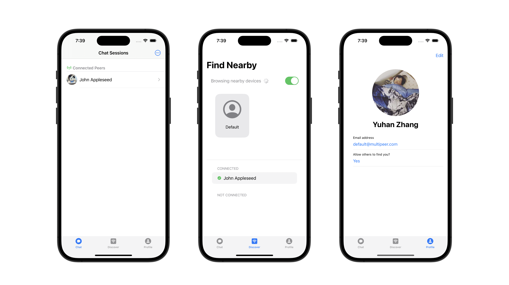

# Find Nearby



[![Platforms][platform-image]][platform-url]
[![Swift Version][swift-image]][swift-url]
[![License][license-image]][license-url]

[platform-image]: https://img.shields.io/badge/platforms-iOS-333333.svg
[platform-url]: https://www.apple.com/ios/
[swift-image]:https://img.shields.io/badge/swift-5.9-orange.svg
[swift-url]: https://swift.org/
[license-image]: https://img.shields.io/badge/License-MIT-blue.svg
[license-url]: LICENSE

This is an iOS (iPadOS) application leveraging locational technology to identify proximal Apple devices and facilitate secure messaging sessions with these devices. It utilizes Apple's [`Multipeer Connectivity API`](https://developer.apple.com/documentation/multipeerconnectivity) to ensure effortless data exchange in a peer-to-peer network environment, unrestrained by internet connectivity limitations.

- [x] ***Privacy at your hand:*** hide your devices whenever you want
- [x] ***User Interface:*** great UI design for better AirDrop-like experience

## Requirements

- iOS 16.0+
- Xcode 14.0+

## Installation

The app is still under development, so it is not available on App Store. If you would like to play with the current version, please follow these steps:

1. Clone this repository
```
git clone https://github.com/ZzhangYH/Find-Nearby.git
```
2. Install [Xcode](https://developer.apple.com/xcode/), and Swift related resources can be found [here](https://swift.org/).
3. Open the project in Xcode and run it on iOS Simulator or your local machine.

---

Distributed under the MIT license. See [`LICENSE`](LICENSE) for more information.
